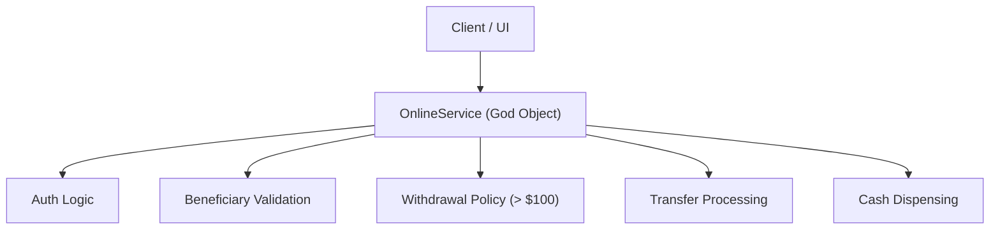
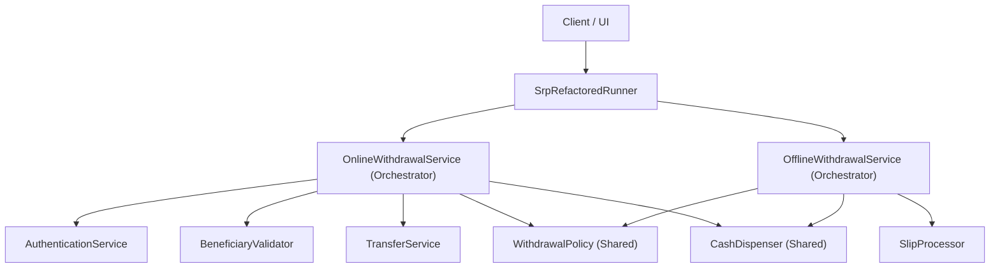

# Single Responsibility Principle (SRP) in Flutter & Dart

## What is SRP?

The **Single Responsibility Principle (SRP)** is the first principle of the **SOLID** acronym introduced by Robert C. Martin ("Uncle Bob").

> **Formal Definition:**  
> *"A module should be responsible to one, and only one, actor."*

In mobile application development, an **actor** represents a single stakeholder, department, or business role requesting changes (e.g., Security Team, Compliance Team, Payments Team, UI/UX Team, Hardware Team). 

If a single class is responsible for fulfilling requirements from multiple actors, it becomes a **"God Object"**. A change requested by one actor risks inadvertently breaking functionality relied upon by another actor.

---

## Actor Mapping: Violation vs Refactored

| Responsibility / Domain | Actor Responsible | Violation (`OnlineService`) | Refactored SRP Class |
| :--- | :--- | :--- | :--- |
| User Identity Verification | Security Team | `OnlineService.login()` | `AuthenticationService` |
| Account & Beneficiary Validation | Compliance Team | `OnlineService.enterDetails()` | `BeneficiaryValidator` |
| Business Withdrawal Limits | Finance / Policy Team | `OnlineService.enterAmount()` | `WithdrawalPolicy` |
| Payment Gateway Transaction | Payments Team | `OnlineService.selectTransferMode()` | `TransferService` |
| Physical Cash Dispensing | ATM Hardware Team | `OnlineService.collectCash()` | `CashDispenser` |
| Physical Paper Slip Handling | Branch Operations Team | `OfflineService.collectWithdrawalSlip()` | `SlipProcessor` |
| Workflow Coordination | Application Developer | Mixed inside monolith | `OnlineWithdrawalService` / `OfflineWithdrawalService` |

---

## Architectural Visualization

### ❌ Violation Architecture (Tightly Coupled Monolith)

In the violation example, `OnlineService` handles all business logic, validation, authentication, and hardware dispensing in a single class:



### ✅ Refactored Architecture (Modular & Reusable Components)

In the refactored design, each service has **one reason to change**. Notice how core rules (`WithdrawalPolicy`) and hardware logic (`CashDispenser`) are seamlessly **reused** across both `OnlineWithdrawalService` and `OfflineWithdrawalService`:



---

## Why is SRP Critical for Flutter Mobile Production Apps?

1. **Maintainability**: Smaller, single-purpose classes are easy to read, navigate, and modify without side effects.
2. **High Reusability**: As demonstrated above, splitting business rules (`WithdrawalPolicy`) allows the exact same rules to be shared across mobile banking, web app, and physical branch kiosk features without copy-pasting code.
3. **Effortless Unit Testing**: Instead of constructing complex setup states or mocking 5 different subsystems, you can test `WithdrawalPolicy` in 3 lines of isolated unit test code.
4. **Git Merge Conflict Reduction**: Developers on different teams (e.g., Security vs Payments) modify separate files (`AuthenticationService.dart` vs `TransferService.dart`), eliminating pull request blocking merge conflicts.

---

## Folder Structure Overview

```text
lib/principles/srp/
├── README.md                           # Documentation & Architectural Guide
├── export.dart                         # Main export barrel for SRP module
├── refactored_export.dart              # Export barrel for refactored components
├── violation_export.dart               # Export barrel for violation components
├── violation/
│   ├── main_violation.dart             # Runner demonstrating monolithic usage
│   ├── offline_service.dart            # Violation handling slip, policy & hardware
│   └── online_service.dart             # "God Object" violation combining 5 actors
└── refactored/
    ├── authentication_service.dart     # Dedicated to user login & credentials
    ├── beneficiary_validator.dart      # Dedicated to account & beneficiary validation
    ├── cash_dispenser.dart             # Dedicated to physical cash dispensing
    ├── withdrawal_policy.dart          # Dedicated to withdrawal limit rules
    ├── transfer_service.dart           # Dedicated to payment gateway transfers
    ├── slip_processor.dart             # Dedicated to physical paper slip processing
    ├── online_withdrawal_service.dart  # High-level orchestrator for online flow
    ├── offline_withdrawal_service.dart # High-level orchestrator for offline flow
    └── main_refactored.dart            # Runner demonstrating clean orchestration & component reuse
```

---

## Key Takeaway for Developers

> **The "And" Rule:**  
> Describe your class's responsibility in a single sentence. If your sentence contains the word **"and"** (e.g., *"This class authenticates users **and** validates beneficiary accounts **and** dispenses cash"*), it violates the Single Responsibility Principle. Extract each **"and"** into its own dedicated class!
